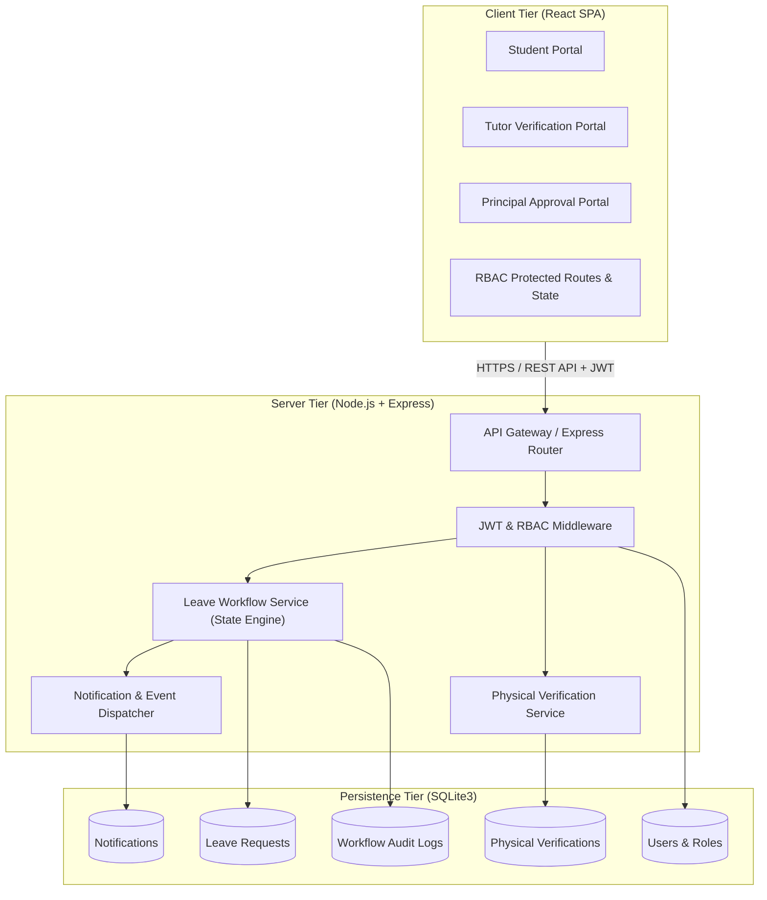
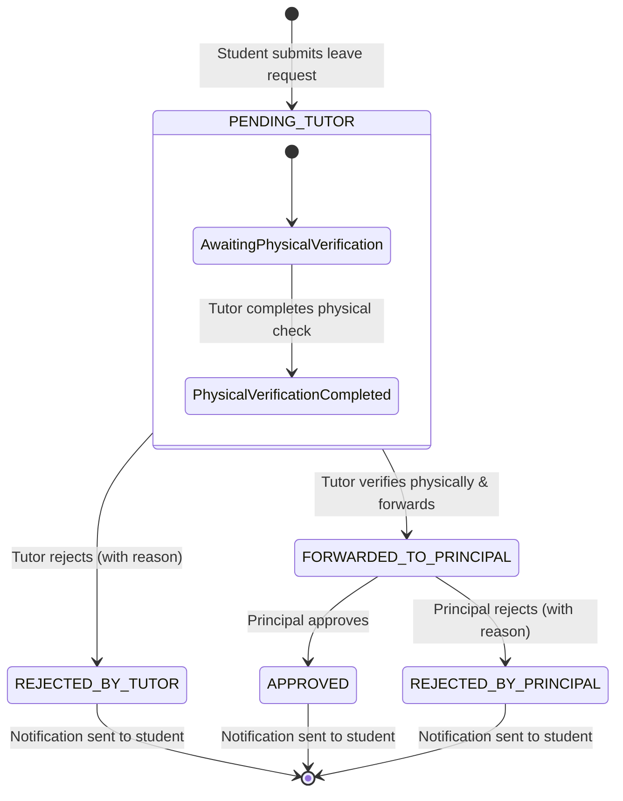
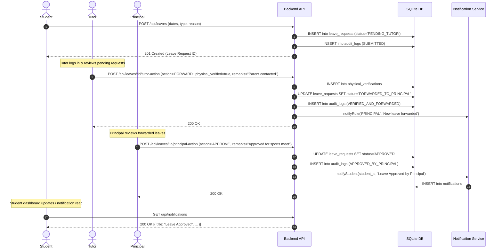
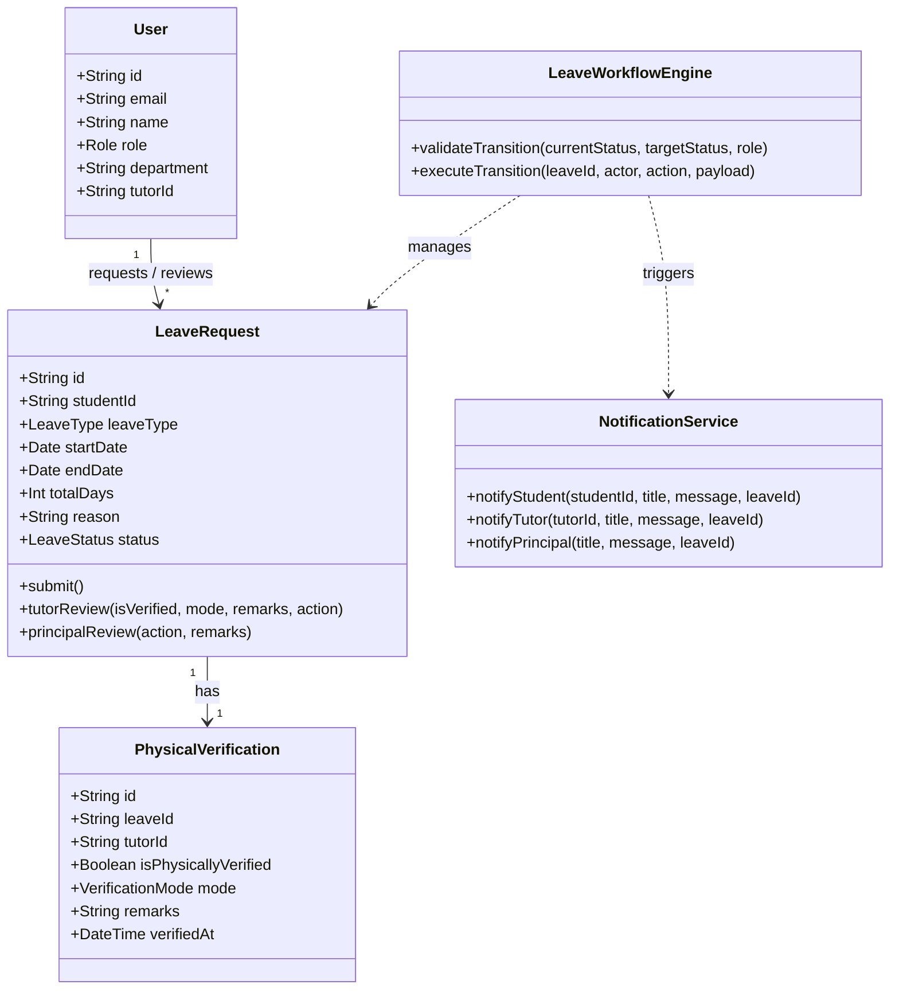

# Low-Level Design (LLD): Leave Management System

## 1. System Overview & Objectives
The Leave Management System is a multi-tier web application enabling college/university students to apply for leaves with a multi-level approval workflow involving **physical verification by Tutors**, **escalation/forwarding to the Principal**, and **instant notification dispatch** upon final decisions.

### Key Actors & Responsibilities
- **Student**: Creates leave requests, views leave status history, and receives real-time notifications.
- **Tutor**: Inspects requests assigned to their ward/section, performs physical verification (verifying student presence, parent consent, or medical proof), adds verification remarks, and forwards to Principal or rejects.
- **Principal**: Final authority who reviews forwarded requests and grants final Approval or Rejection.
- **Admin**: Manages user accounts, department associations, and system configuration.

---

## 2. System Architecture



---

## 3. Role-Based Access Control (RBAC) Specification

### 3.1 Role Hierarchy & Permissions Matrix

| Permission | Student | Tutor | Principal | Admin |
| :--- | :---: | :---: | :---: | :---: |
| `LEAVE_CREATE` | ✅ | ❌ | ❌ | ❌ |
| `LEAVE_VIEW_OWN` | ✅ | ✅ | ✅ | ✅ |
| `LEAVE_VIEW_ASSIGNED` | ❌ | ✅ | ❌ | ❌ |
| `LEAVE_VIEW_ALL` | ❌ | ❌ | ✅ | ✅ |
| `LEAVE_PHYSICAL_VERIFY` | ❌ | ✅ | ❌ | ❌ |
| `LEAVE_FORWARD_PRINCIPAL` | ❌ | ✅ | ❌ | ❌ |
| `LEAVE_TUTOR_REJECT` | ❌ | ✅ | ❌ | ❌ |
| `LEAVE_FINAL_APPROVE` | ❌ | ❌ | ✅ | ❌ |
| `LEAVE_FINAL_REJECT` | ❌ | ❌ | ✅ | ❌ |
| `USER_MANAGE` | ❌ | ❌ | ❌ | ✅ |

---

## 4. Leave Workflow State Machine

The leave request lifecycle follows a strict deterministic finite state machine (FSM):



### Transition Rules
1. Only the student can transition from `(none)` to `PENDING_TUTOR`.
2. Only the assigned Tutor can transition from `PENDING_TUTOR` to:
   - `FORWARDED_TO_PRINCIPAL` (Requires: `is_physically_verified = true` and `tutor_remarks`)
   - `REJECTED_BY_TUTOR` (Requires: `tutor_remarks`)
3. Only the Principal can transition from `FORWARDED_TO_PRINCIPAL` to:
   - `APPROVED` (Requires: optional/mandatory `principal_remarks`)
   - `REJECTED_BY_PRINCIPAL` (Requires: `principal_remarks`)
4. Any transition to terminal states (`APPROVED`, `REJECTED_BY_TUTOR`, `REJECTED_BY_PRINCIPAL`) triggers the `NotificationObserver`.

---

## 5. Sequence Diagram



---

## 6. Database Schema Design (SQLite3)

### 6.1 `users`
```sql
CREATE TABLE users (
    id TEXT PRIMARY KEY,               -- UUID or NanoID
    email TEXT UNIQUE NOT NULL,
    password_hash TEXT NOT NULL,
    name TEXT NOT NULL,
    role TEXT NOT NULL CHECK(role IN ('STUDENT', 'TUTOR', 'PRINCIPAL', 'ADMIN')),
    department TEXT NOT NULL,
    reg_number TEXT,                   -- Student Roll No or Employee ID
    tutor_id TEXT,                     -- Foreign Key references users(id) for students
    created_at DATETIME DEFAULT CURRENT_TIMESTAMP,
    FOREIGN KEY (tutor_id) REFERENCES users(id) ON DELETE SET NULL
);
```

### 6.2 `leave_requests`
```sql
CREATE TABLE leave_requests (
    id TEXT PRIMARY KEY,
    student_id TEXT NOT NULL,
    leave_type TEXT NOT NULL CHECK(leave_type IN ('MEDICAL', 'CASUAL', 'ACADEMIC', 'EMERGENCY', 'DUTY')),
    start_date DATE NOT NULL,
    end_date DATE NOT NULL,
    total_days INTEGER NOT NULL,
    reason TEXT NOT NULL,
    status TEXT NOT NULL DEFAULT 'PENDING_TUTOR' CHECK(
        status IN (
            'PENDING_TUTOR',
            'REJECTED_BY_TUTOR',
            'FORWARDED_TO_PRINCIPAL',
            'APPROVED',
            'REJECTED_BY_PRINCIPAL'
        )
    ),
    created_at DATETIME DEFAULT CURRENT_TIMESTAMP,
    updated_at DATETIME DEFAULT CURRENT_TIMESTAMP,
    FOREIGN KEY (student_id) REFERENCES users(id) ON DELETE CASCADE
);
```

### 6.3 `physical_verifications`
```sql
CREATE TABLE physical_verifications (
    id TEXT PRIMARY KEY,
    leave_id TEXT UNIQUE NOT NULL,
    tutor_id TEXT NOT NULL,
    is_physically_verified BOOLEAN NOT NULL DEFAULT 0,
    verification_mode TEXT CHECK(verification_mode IN ('IN_PERSON', 'PARENT_CALL', 'MEDICAL_SLIP', 'OTHER')),
    remarks TEXT NOT NULL,
    verified_at DATETIME DEFAULT CURRENT_TIMESTAMP,
    FOREIGN KEY (leave_id) REFERENCES leave_requests(id) ON DELETE CASCADE,
    FOREIGN KEY (tutor_id) REFERENCES users(id)
);
```

### 6.4 `leave_audit_logs`
```sql
CREATE TABLE leave_audit_logs (
    id TEXT PRIMARY KEY,
    leave_id TEXT NOT NULL,
    actor_id TEXT NOT NULL,
    actor_role TEXT NOT NULL,
    action TEXT NOT NULL,              -- 'SUBMIT', 'TUTOR_FORWARD', 'TUTOR_REJECT', 'PRINCIPAL_APPROVE', 'PRINCIPAL_REJECT'
    remarks TEXT,
    created_at DATETIME DEFAULT CURRENT_TIMESTAMP,
    FOREIGN KEY (leave_id) REFERENCES leave_requests(id) ON DELETE CASCADE,
    FOREIGN KEY (actor_id) REFERENCES users(id)
);
```

### 6.5 `notifications`
```sql
CREATE TABLE notifications (
    id TEXT PRIMARY KEY,
    user_id TEXT NOT NULL,
    title TEXT NOT NULL,
    message TEXT NOT NULL,
    leave_id TEXT,
    is_read BOOLEAN NOT NULL DEFAULT 0,
    created_at DATETIME DEFAULT CURRENT_TIMESTAMP,
    FOREIGN KEY (user_id) REFERENCES users(id) ON DELETE CASCADE,
    FOREIGN KEY (leave_id) REFERENCES leave_requests(id) ON DELETE SET NULL
);
```

---

## 7. Software Design Patterns & Class Diagram

### 7.1 Applied Design Patterns
1. **State Pattern (Leave Workflow Engine)**: Encapsulates status validation and ensures invalid transitions (e.g. Tutor trying to directly finalize approval without Principal, or Student editing an already forwarded request) are rejected cleanly.
2. **Observer / Event-Driven Pattern (Notification Dispatcher)**: Decouples business logic from notification channels (in-app DB alerts, future email/SMS hooks).
3. **Repository & Service Pattern**: Keeps SQLite database queries cleanly separated from Express routing handlers and business validation rules.
4. **Strategy / Middleware Pattern**: RBAC authorization guards wrapped into clean Express middleware functions (`authenticateToken`, `requireRoles(['TUTOR'])`).

### 7.2 Class Diagram



---

## 8. RESTful API Contract

### Authentication & Profiles
- `POST /api/auth/register` - Register a student or staff member.
- `POST /api/auth/login` - Authenticate and retrieve JWT token with embedded role & claims.
- `GET /api/auth/me` - Get current session user profile.

### Leave Management (RBAC Protected)
- `POST /api/leaves`
  - **Role:** `STUDENT`
  - **Body:** `{ leave_type, start_date, end_date, reason }`
  - **Response:** `201 Created`
- `GET /api/leaves`
  - **Role:** `ALL` (Filtered by role: Student sees own; Tutor sees assigned students; Principal sees forwarded/all)
  - **Query:** `status`, `page`, `limit`
- `GET /api/leaves/:id`
  - **Role:** Access controlled to student owner, assigned tutor, or principal. Includes verification info & audit history.
- `POST /api/leaves/:id/tutor-verify-forward`
  - **Role:** `TUTOR`
  - **Body:** `{ action: "FORWARD" | "REJECT", is_physically_verified: boolean, verification_mode: string, remarks: string }`
  - **Behavior:** If `action === 'FORWARD'`, requires `is_physically_verified: true`. Updates status to `FORWARDED_TO_PRINCIPAL` or `REJECTED_BY_TUTOR`.
- `POST /api/leaves/:id/principal-decision`
  - **Role:** `PRINCIPAL`
  - **Body:** `{ action: "APPROVE" | "REJECT", remarks: string }`
  - **Behavior:** Updates status to `APPROVED` or `REJECTED_BY_PRINCIPAL`. Fires student notification.

### Notifications
- `GET /api/notifications` - Retrieve list of user notifications.
- `PATCH /api/notifications/:id/read` - Mark notification as read.
- `POST /api/notifications/mark-all-read` - Mark all as read.

---

## 9. Frontend Architecture (React)

### Layout & Component Hierarchy
```
src/
├── components/
│   ├── common/
│   │   ├── Navbar.jsx (Profile, Role badge, Notifications bell with unread badge)
│   │   ├── NotificationDropdown.jsx
│   │   ├── StatusBadge.jsx (Color-coded status chips with step progression)
│   │   └── Modal.jsx
│   ├── student/
│   │   ├── ApplyLeaveModal.jsx (Form with date calculations, reason, validation)
│   │   ├── StudentLeaveList.jsx (History table with audit trail accordion)
│   │   └── LeaveTimeline.jsx (Visual step indicator: Applied -> Tutor Verified -> Principal Approved)
│   ├── tutor/
│   │   ├── TutorPendingQueue.jsx (Assigned student leave requests)
│   │   └── PhysicalVerificationModal.jsx (Physical check toggle, mode selector, reason input)
│   └── principal/
│       ├── PrincipalReviewQueue.jsx (Forwarded requests with tutor verification remarks)
│       └── DecisionModal.jsx (Approval/Rejection with executive remarks)
├── context/
│   ├── AuthContext.jsx (JWT auth, role persistence, login/logout)
│   └── NotificationContext.jsx (Polling / event updates, unread count)
├── pages/
│   ├── LoginPage.jsx (Quick demo persona switcher for instant testing + login form)
│   ├── DashboardPage.jsx (Dynamic view based on user role)
│   └── LeaveDetailsPage.jsx (Full inspection view with timeline)
└── services/
    └── api.js (Axios / Fetch client with JWT interceptor)
```

---

## 10. Security & Verification Guardrails
1. **Physical Verification Integrity**: The backend enforces `is_physically_verified === 1` when forwarding to the Principal. Attempting to forward without physical verification returns `400 Bad Request`.
2. **Student Isolation**: Students can never view or modify other students' leave requests.
3. **Immutability of Historical Leaves**: Once decided (`APPROVED`, `REJECTED`), a leave request cannot be altered. All actions are logged into `leave_audit_logs`.
4. **JWT Security**: Passwords hashed with `bcrypt`, stateless JWT containing `{ id, role, email, department }`.
